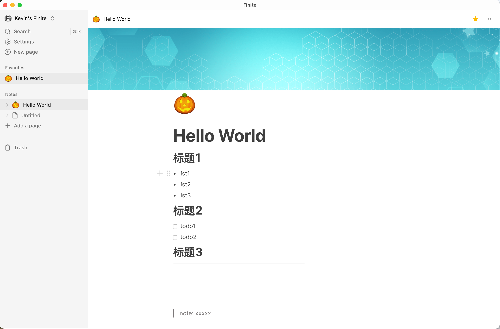

# Finite

Notion like markdown note-taking app base on [Tauri](https://v2.tauri.app/) and [Next.js]((https://nextjs.org/).




## Getting Started

To develop and run the frontend in a Tauri window:

```shell
pnpm tauri dev
```

### Building for release


```shell
pnpm tauri build
```

## Learn More

To learn more about Next.js, take a look at the following resources:

- [Next.js Documentation](https://nextjs.org/docs) - learn about Next.js features and API.
- [Tauri2.0 Documentation](https://v2.tauri.app/start/) - learn about the Tauri toolkit.
