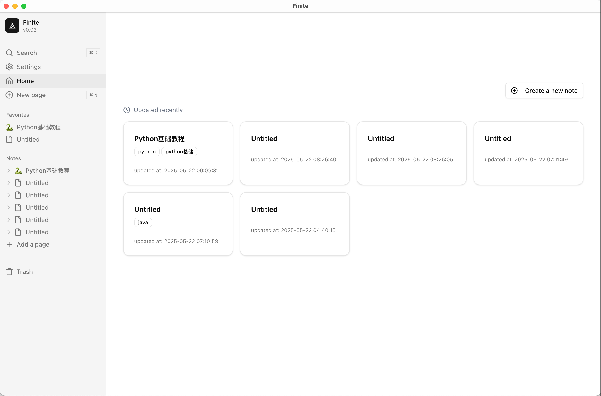

# Finite

A notion like markdown note-taking app base on [Tauri2](https://v2.tauri.app/) and [Next.js](https://nextjs.org/).

Inspired by [Antonio's notion-clone video](https://www.youtube.com/watch?v=0OaDyjB9Ib8)
- template: [tauri-nextjs-template](https://github.com/kvnxiao/tauri-nextjs-template)
- editor: [BlockNote](https://github.com/TypeCellOS/BlockNote)
- database: sqlite


## Shortcuts




## Getting Started

To develop and run the frontend in a Tauri window:

```shell
pnpm tauri dev
```

### Building for release


```shell
pnpm tauri build
```

## Learn More

To learn more about Next.js, take a look at the following resources:

- [Next.js Documentation](https://nextjs.org/docs) - learn about Next.js features and API.
- [Tauri2.0 Documentation](https://v2.tauri.app/start/) - learn about the Tauri toolkit.
- [Lucide Icons](https://lucide.dev/icons/)
- [Shadcn/ui Blocks](https://ui.shadcn.com/blocks)
- [v0](https://v0.dev/)
